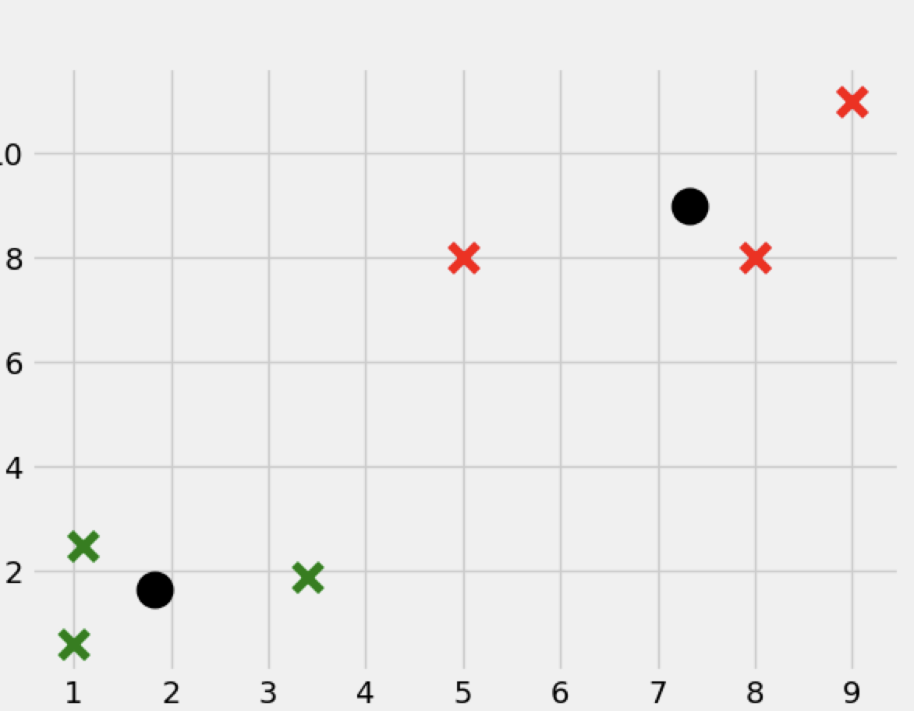
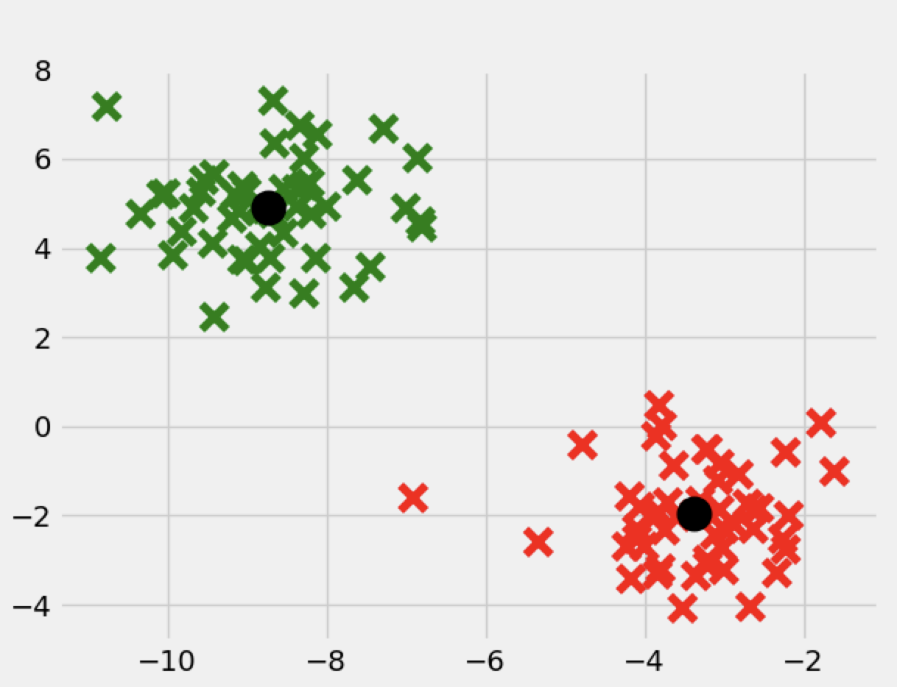
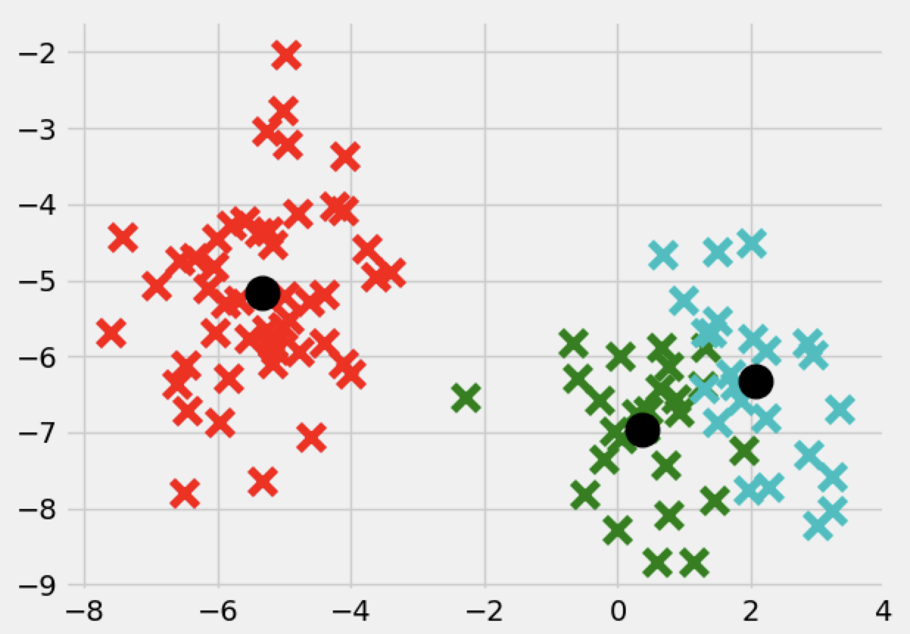

# TASK For Interview

# Estimated Time to Finish
2 hours, I have tried to upload the code first as an attachments but there was an error in the Gmail through linkedin as it doesn't accept attached files. Therefore I have uploaded the project to my GitHub.

# - TASK
Given a set of two dimensional points P (e.g. ....) find the size of set can be (100s).

- Write a function that calculates simple K-means, the expected returned value from the function are:

1. a Aet of cluster ID that each point belongs to
2. coordinates of centroids at the end of iteration.


# - RESPONSE
```
python ProjectFiles/Task1.py

```


# First we show a test of the kMeans algorithm
Using an assumed values such as:

```
X = np.array([[1.1,2.5],
              [3.4,1.9],
              [5,8],
              [8,8],
              [1,0.6],
              [9,11]])
```
We can get the centroids of two groups classification -Showed in black color
Group 0- in Green color,
Group 1- in Red color

# Ouput

Classifying the featureset of given observations to which group it belongs.

```
the featureset of 1.1,2.5 belong to Group0
the featureset of 3.4,1.9 belong to Group0
the featureset of 1.0,0.6 belong to Group0
the featureset of 5.0,8.0 belong to Group1
the featureset of 8.0,8.0 belong to Group1
the featureset of 9.0,11.0 belong to Group1
```

And with centroids as

```
=====Centroid of group0=1.8333333333333333,1.6666666666666667
=====Centroid of group1=7.333333333333333,9.0
```



# Bonus
We proceed with the algorithm to use it with a sample size of 100 points. I have generated 100 points using the following library

 ```
 sklearn.datasets.samples_generator
 ```
Since the points are random and they can change everytime you run the code I here show for two group an example:



and for three groups





# NOTE

I can refine the algorithm more but up to this point I hope it will be sufficient for the testing purpose.
